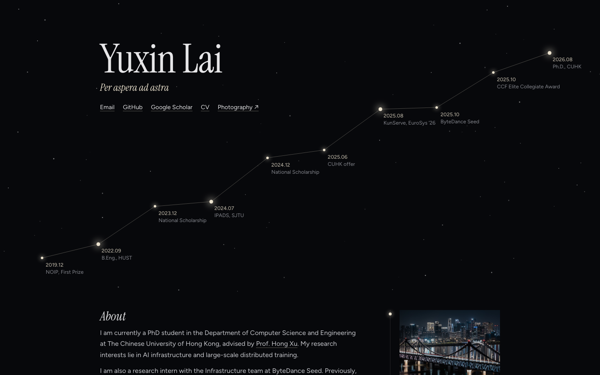

# Yuxin Lai 的个人主页

[yuxinlai.com](https://yuxinlai.com) 的源码。基于 Jekyll，由 GitHub Pages 自动构建发布。



## 修改内容

主页上的所有内容都在 [`index.md`](index.md) 里。改完推送到 `main` 分支，GitHub Pages 会自动重新构建（仓库 Actions 页里的 *pages build and deployment*），一两分钟后生效。

文件头部（两行 `---` 之间）是配置：

| 字段 | 作用 |
| --- | --- |
| `title`、`motto` | 首屏的名字和格言，也用作网页标题和描述 |
| `links` | 名字下方的链接，按书写顺序显示 |
| `gallery` | 摄影网站的名称和地址，自动加到链接末尾，所有照片都链接到这里 |
| `milestones` | 首屏星座上的节点，从早到晚排列；`big: true` 画一颗更亮的星 |
| `margin` | 正文右侧页边的内容，按节标题对应：照片（`photo`、`alt`、`caption`，可选的裁切位置 `focus`）或一段 Markdown 注释（`note`） |

YAML 里的日期要加引号（`"2025.10"`），否则会被读成数字 2025.1。

正文是普通 Markdown：

- 每个 `## 标题` 是一节，对应页面上的一行，也会自动出现在顶部导航栏里。
- 以斜体日期开头的列表项，日期会排进左侧的日期栏，例如 `- *2025.08* KunServe is accepted by EuroSys 2026!`。
- 论文写成 `### [标题](链接)`，紧跟的一段（作者、会议）显示为灰色小字。

在手机上，页边的照片会集中到页面末尾，排成一行横向滑动。

## 本地预览

需要 Ruby 3.3（GitHub Pages 依赖的 commonmarker 还不支持 Ruby 4）：

```sh
brew install ruby@3.3
export PATH="/opt/homebrew/opt/ruby@3.3/bin:$PATH"
bundle install
bash run_server.sh   # 打开 http://127.0.0.1:4000，保存文件后页面自动刷新
```

修改 `_config.yml` 后需要重启服务。

## 文件结构

| 文件 | 内容 |
| --- | --- |
| `index.md` | 主页的全部内容 |
| `_layouts/default.html` | 页面结构：星空首屏、导航栏、正文和页边 |
| `_includes/photo.html` | 带拍摄参数的照片 |
| `assets/css/main.css` | 样式 |
| `_config.yml` | 站点设置：域名、Markdown、插件 |
| `assets/CV.pdf`、`images/` | 简历、头像和网站图标 |

## 致谢

最初基于 [AcadHomepage](https://github.com/RayeRen/acad-homepage.github.io)（MIT License）。
